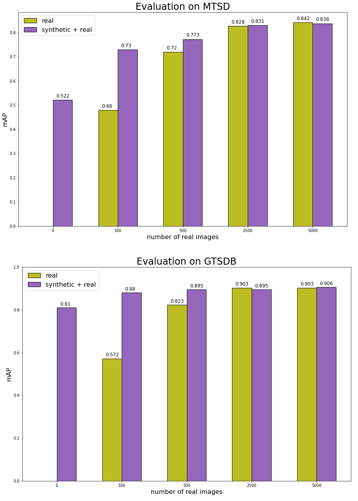

Synthetic data project
==============================

Synthetic data for traing deep neural networks for object detection on traffic signs.


## Content

- [Synthetic data project](#synthetic-data-project)
  - [Content](#content)
  - [Real data](#real-data)
  - [Synthetic data](#synthetic-data)
  - [Detection example](#detection-example)
  - [Model](#model)
  - [Erros](#erros)
  - [Important factors for gerating synthetic data](#important-factors-for-gerating-synthetic-data)
  - [Using synthetic data for pre-training](#using-synthetic-data-for-pre-training)
  - [Implementation details](#implementation-details)
  - [Requirements](#requirements)
  - [Run](#run)
  - [Project Structure](#project-structure)


## Real data

For real data the [Mapillary Traffic Sign Dataset](/reports/MTSD/README.md) is used for training and testing.
Only a subset of the data is used, where the classes in [templates](/data/templates/) are chosen to target the [GTSDB](https://benchmark.ini.rub.de/), which then can be used for testing.

## Synthetic data

The method for generating synthetic data follows https://arxiv.org/abs/1907.09679, where [templates](/data/templates/) are placed randomly on backgrounds from [COCO dataset](https://cocodataset.org/#home).


Examples of the generated synthetic images:


## Detection example
A detection example on GTSDB:


## Model


A Faster R-CNN model has been trained for detection, while a ResNet has been trained for classification.
For testing, detections from the detector is then given to the classifer.

A baseline trained on real images get a score of **0.84** mAP on MTSD and **0.90** mAP on GTSDB.
The authors of MTSD get a similar score (but they also use more classes).

A model trained on synthetic images get a score of **0.52** mAP on MTSD and **0.81** mAP on GTSDB.


## Erros

It was found that the models trained on synthetic data performs a different kind of error than the models trained on real data. It is likely that the synthetic data does not generalize enough:


## Important factors for gerating synthetic data

Different experiments were done to find which factors for the synthetic data generation are most important.

The worst performing method is the one using backgrounds of images in simple colors instead of using the images from COCO.


| **Method**                 	    |       mAP MTSD 	|      mAP GTSDB 	|
|--------------------------------	|---------------:	|---------------:	|
| 1. no perspective  constraint   	|    **0.542**  	|      0.827     	|
| 2. *original*                 	|     *0.539*   	|     *0.820*  	    |
| 3. add distractions             	|      0.531     	|    **0.837** 	    |
| 4. no alpha blending            	|      0.529     	|      0.810     	|
| 5. no geometric transformations 	|      0.508     	|      0.680     	|
| 6. no uniform noise             	|      0.501     	|      0.800     	|
| 7. no prior brightness adjust   	|      0.495     	|      0.751     	|
| 8. no post brightness adjust    	|      0.454     	|      0.688     	|
| 9. simple backgrounds           	|      0.392     	|      0.677     	|


## Using synthetic data for pre-training

Here the synthetic images are used for pre-training models, while fine-tuning with different number of real images.

It is made sure that the classes are balanced for the models where a small number of real images are used.

It can be seen that it can be useful to use synthetic data when the number available of real images is limited, while it does not make any difference when a lot of real data is available.





## Implementation details
The implementation of the models used are form [PyTorch](https://pytorch.org/vision/stable/models.html).

[Hydra](https://github.com/facebookresearch/hydra) is used for managing configs.

[Albuementations](https://albumentations.ai/docs/) and [OpenCV](https://opencv.org/) is used for augmentations.

[TIDE](https://pypi.org/project/tidecv/) is used for evaluating errors.


## Requirements
Virtual environment and dependencies with `conda`:
```bash
conda create --name [name] python=3.9
```

Install requirements (in virtual environment): 
```bash
pip install -r requirements.txt
```


## Run
To genetate synthetic data
```bash
python generate_synthetic_data.py
```

Train detector:
```bash
python train_detection.py
```

Train classifier:
```bash
python train_classifier.py
```

Test:
```bash
python test.py
```

Use the [config](conf/) files for configuration 


## Project Structure


```
├── conf                    <- Hydra configuration files
│
├── data                    <- Project data
│
├── outputs                 <- Logs generated by Hydra and loggers
│
├── reports                 <- Reports, results, notes, pdfs, figures etc.
│
├── src                     <- Source code
│   │
│   ├── augmentations.py        <- Augmentations used for generating synthetic data
│   ├── config.py               <- @dataclasses describing the config files
│   ├── datasets.py             <- PyTorch Datasets
│   ├── engine.py               <- Training and test functions
│   ├── models.py               <- Classifiers
│   ├── transforms.py           <- Transformations for training and test
│   └── utils.py                <- Utility functions
│
├── generate_synthetic_data.py  <- For generating synthetic data
|
├── train_classifier.py     <- Run training of classifer
├── train_detection.py      <- Run training of detector
├── test.py                 <- Run testing
├── test_detection.py       <- Run testing of only detector
│
├── .env                    <- Private environment variables
├── .gitignore              <- List of files/folders ignored by git
├── requirements.txt        <- File for installing python dependencies
├── setup.cfg               <- Configuration of linters
├── pyproject.toml          <- Configuration of black
└── README.md
```


--------


